# Neural-Network-from-Scratch

 
>[!TIP]
 
> You can use this project to learn ANN from scratch.
 
 
#### Hi, I created a neural network from scratch. I'll explain how it works and the steps of a neural network:
 
## Oh, I forgot to say I use backpropagation for training the neural network. I'll explain how backpropagation works end-to-end:
 
> [!NOTE] 
 
> If you don't know what gradient descent is, please learn about it first. It is used in backprop to find the best weights and bias values. You can learn it from the 3Blue1Brown channel on YouTube.
 
### Backpropagation is an algorithm used to train neural networks. We use backprop to find the best weights and bias values using gradient descent. We find the derivatives in reverse order to get the gradient of every trainable weight and bias.
 
### So how do we use gradient descent to find the best weights and biases? We use this formula to find the best weights and bias values:
 
$$
W_{\text{new}} = W_{\text{old}} - \eta \frac{\partial L}{\partial W_{\text{old}}}
$$
 
### This is the gradient descent formula.
 
### How this formula works:
- η = learning rate
- W_new = new value of that weight
- W_old = old value of the current weight
- The last term (with the learning rate) is the gradient of the old weight
### What is gradient descent?
#### Gradient descent is an algorithm used to train a model by minimizing the error between predicted and actual results. We use gradient descent to get the best values of weights and biases so we can reduce the loss. Gradient descent has 3 types:
- Batch Gradient Descent
- Stochastic GD
- Mini-Batch GD
#### Let me explain in 2 lines how each of these works:
### Batch GD:
- In batch GD we use the entire dataset to update the weights and biases in 1 epoch (1 batch).
```
epoch = 100
for i in range(epoch):
    here u update weight and bias using gd formula
```
### Stochastic GD:
- The most used GD in neural networks and in ML. It helps us escape local minima and find the global minimum.
- It updates the weights and bias n times in 1 epoch, where n is the number of rows in the dataset. So if you have 100 rows, it updates 100 times in 1 epoch — it converges fast, but not necessarily in less time. Remember this.
- One thing to note: when we run the inner loop n times (once per row), we pick a random row from the dataset each time. Remember this.
```
 
epoch = 10
for i in range(epoch):
    for j in range(total rows in dataframe):
        update gd using gd formula
```
 
### Mini-batch GD:
- In mini-batch GD we create batches and run on those batches within 1 epoch. For example, in 1 epoch you might create several batches. If your dataset contains 200 rows and your batch size is 100, then in 1 epoch the inner loop runs twice: once for the first batch of 100 rows, and once for the second batch of 100 rows.
```
df = 200 rows 
batch = 100
epoch = 2
for i in range(epoch):  # this loop runs for n epochs
    for j in range(batch):  # this loop runs for n batches
        here u update your weight and bias using gd formula
 
```
 
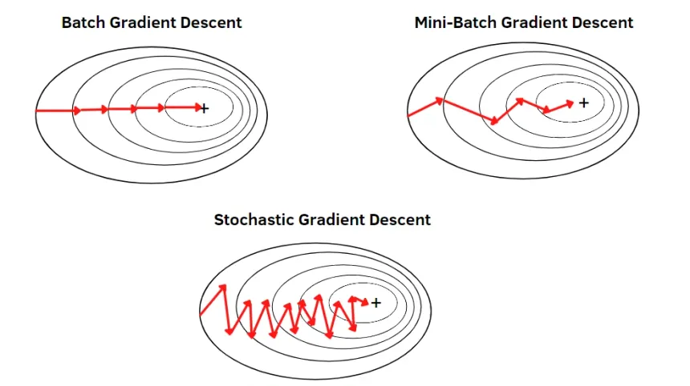
- You can see in the image above that stochastic gradient descent moves in a zig-zag pattern. This happens because a random row is selected each time — that's also why stochastic GD finds the global minimum more easily than mini-batch and batch GD, and converges to it faster.
### Why do we need a learning rate? What happens if we don't use one, or set it too big or too small?
 
- If you don't use a learning rate, or set it too high (e.g., 1), the model converges very drastically and overshoots — your loss will become NaN; you'll just see the loss turn into NaN.
- If you set a learning rate too low, close to zero, your model converges very slowly and may never find the global minimum.
- So you need to set it to something like 0.001, 0.1, 0.01, 0.05, etc.
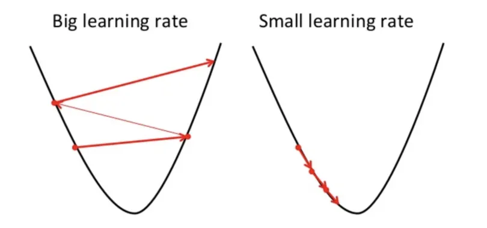
 
#### Now you understand how gradient descent works.
 
## How backpropagation works:
- We initialize parameters
- We do forward propagation
- Then we compute the predicted loss
- Then we use backpropagation to find the best weights and bias values that decrease the loss
- Then we check the loss
### We find the gradient of all parameters using derivatives
- Why do we use derivatives? A derivative tells you what happens to the loss if you change a weight's value.
- For that we use the chain rule to calculate gradients.
### So the next question is: why does backpropagation work so well?
- 1st Reason — the concept of a gradient:
    - When your function depends on only one variable, you call it a derivative. Example: y = f(x), where f(x) = x^2 + x — this is an example of a derivative.
    - When your function depends on more than one variable, we call it a gradient. Example: f(x, y) = x^2 + y^2. If you take the partial derivative of f with respect to x, you get 2x; if you take the partial derivative of f with respect to y, you get 2y.
- 2nd Reason — effect of the learning rate:
    - The learning rate makes the steps smooth.
- 3rd Reason — the concept of derivatives (rate of change):
    - dy/dx = 2 (positive direction)
    - A derivative shows you what happens to y when x changes — whether the effect is positive or negative. That's the reason we use backpropagation.
 
```
epochs = 10
for i in range (epochs):
    for j in range(df.shape[0]): 
        data (X) and y values 
        forward propagation are used 
        predection(y)
        then we use Backpropagation to find best weights and biases
        using Gradient Descent
```
 
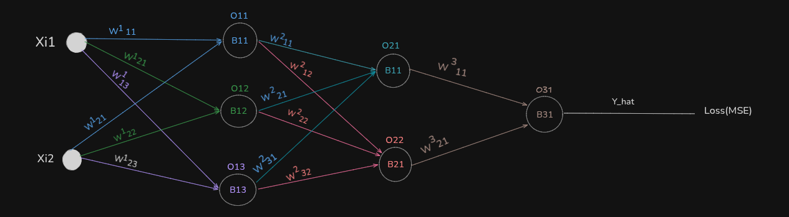
 
 
### So, how do we calculate the gradients? I did this in my notebook, so let me show you how to calculate the gradients for regression. In regression we use a linear activation function.
 
<p align="center">
  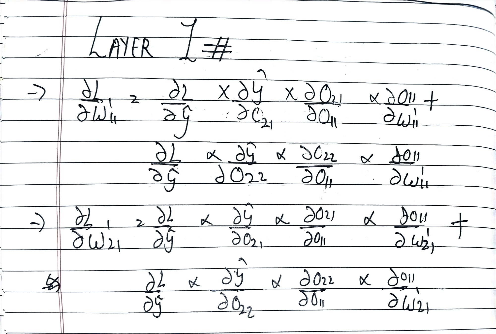
  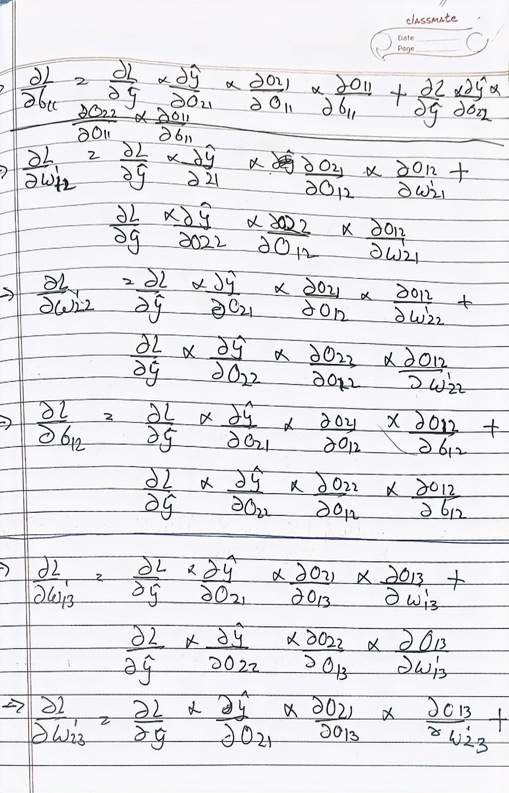
  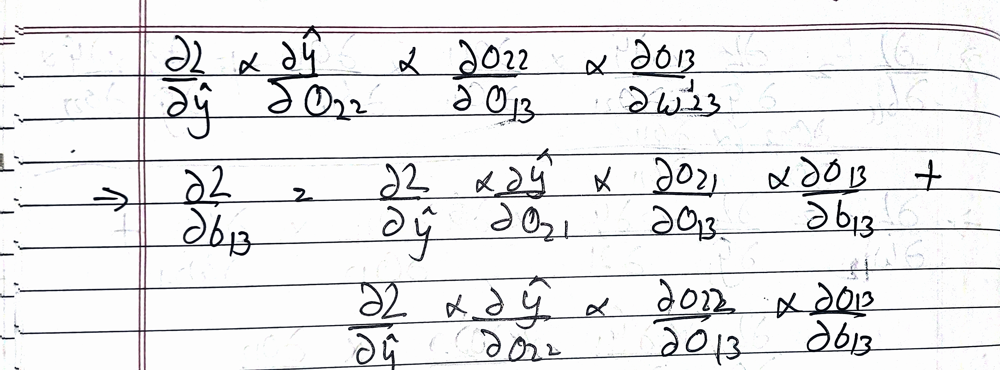
</p>
### Now here I find the derivatives of all the gradients.
 
<p align="center">
  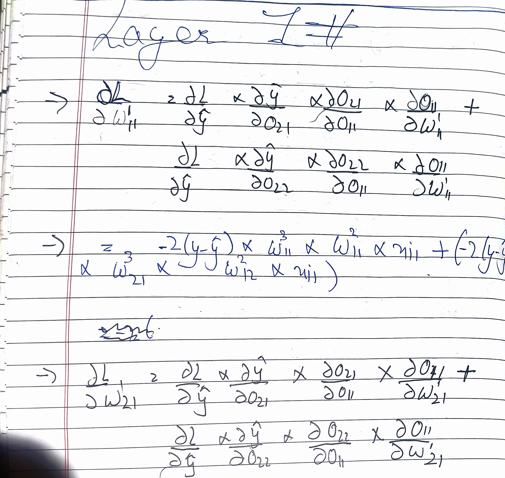
  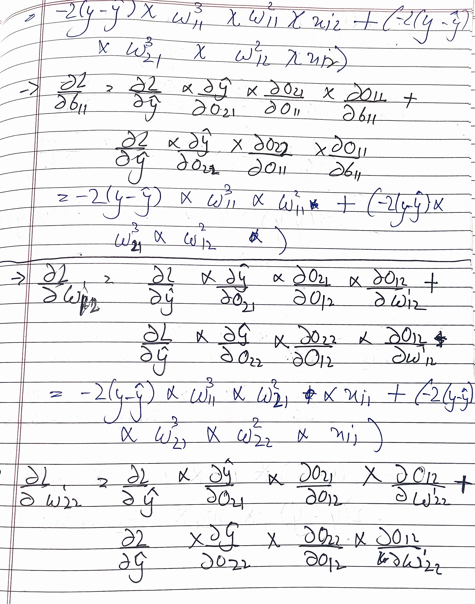
  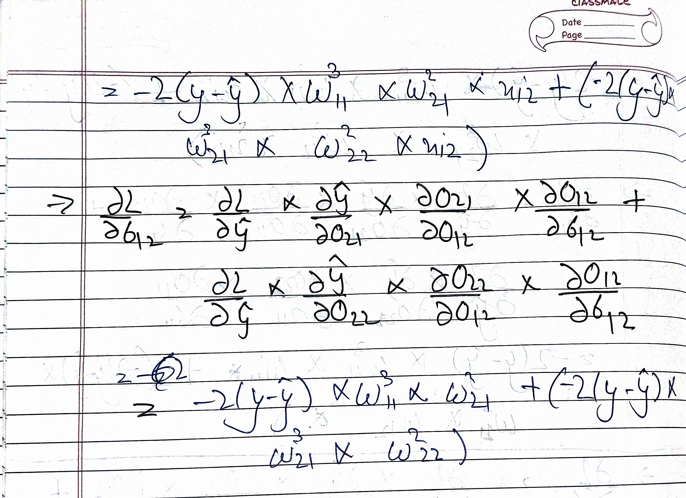
  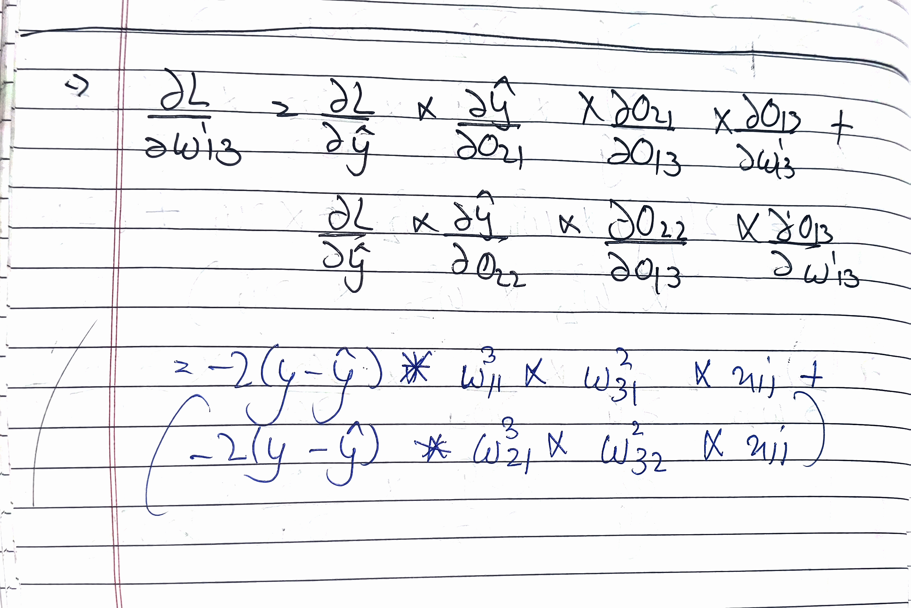
  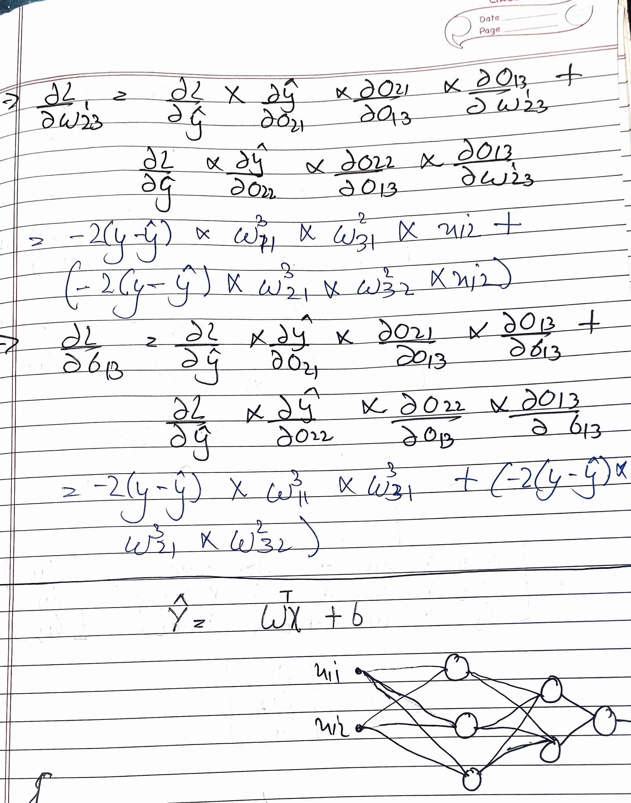
</p>
###  Matrix multiplication of weights and biases
 
<p align="center">
  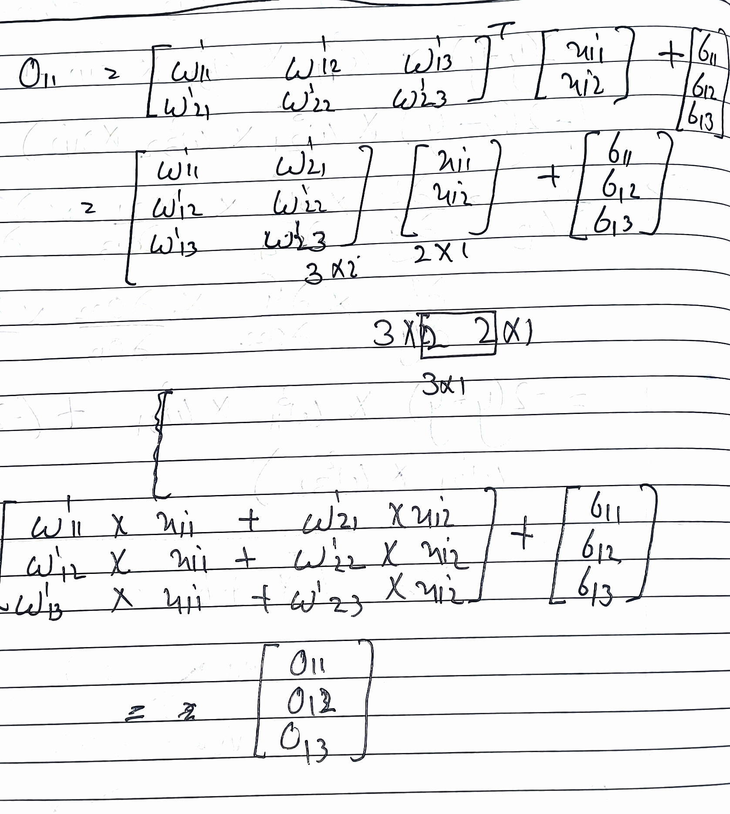
  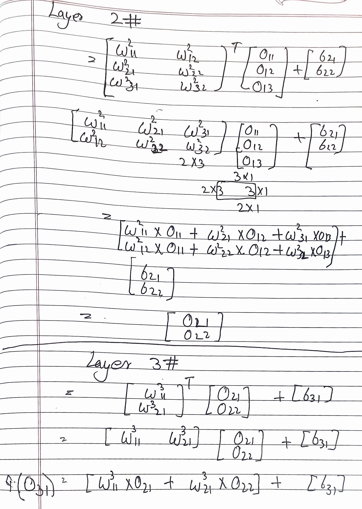
</p>
 
